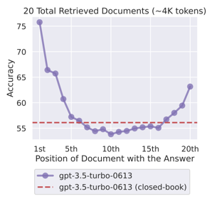
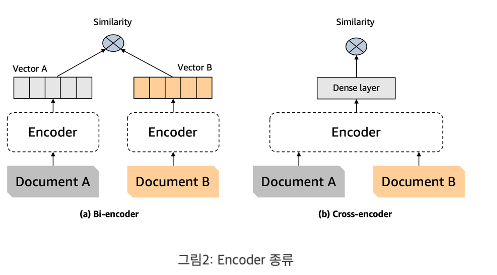

# 현자의 돌 LLM with RAG

서강대학교 인공지능 대학원 석사, 연픽 AI Engineer 조재찬 

---

1. Langchain-ai[, langchain-ai/langchain](https://github.com/langchain-ai/langchain?tab=readme-ov-file)
2. OpenAI, [API Services](https://platform.openai.com/)
3. Naver, [NaverCloudPlatform Services](https://www.ncloud.com/)
4. Cohere, [CohereReranker Services](https://cohere.com/)
5. Nelson F. Liu et al. [“Lost in the Middle: How Language Models Use Long Contexts”](https://arxiv.org/abs/2307.03172), TACL 2023

---

목표는 현자의 돌 수능 윤리 관련 자료들을 바탕으로 학생들의 질의에 대응을 해주는 챗봇을 제작하려고 한다. 특히, 본 문서는 Langchain을 이용한 RAG(Retrieval Augument Generation), 검색 증강 생성을 이용해 답변의 신뢰 및 정확도를 향상시키려고 한다.

# 1. 연구 모델 구조 및 기술 설명

### 1. 모델 구조

### 2. 기술 설명

1. Query
    1. 학생들의 질의 응답
    2. 질의 응답에 포함된 특정 문제 선지
2. VectorDB
    1. Raw Files
        - 평가원 문제 및 해설
        - 교과서 텍스트 정의
        - 원전 텍스트
    2. Clean Datasets
        1. Text Cleanser
            - 각주, 공백, 기호 선택 및 제거
        2. Text Chunkify(Tokenize)
            - Tokenizer를 활용한 텍스트 특정 길이로 묶기
                1. OpenAI tiktoken “cli100k_base”
                2. Clova “LK-D2”
                3. 최대 임베딩 제한 300 토큰 기준
    3. Translation
        - 한글을 영어로 번역, Naver Papago
            - VoyageAI/ OpenAI 모델 사용시
            - 단, Clova는 번역 X
    4. Embedding
        - 텍스트를 pretrained encoder로 숫자화(vectorize)
            - *VoyageAI Embedder(best)
                - 아래 첨부 자료에 따르면, 학습 시기와 도메인 범용성 차이로 VoyageAI가 더 우수한 결과를 나타냈다고 보고함.
                - 실제로 실험 결과도 5~10% 정도 더 우수함. (단, voyage-2로 테스트한 결과)
            - OpenAI Embedder
            - Clova Embedder(worst)
                
                
                
                [Embeddings Drive the Quality of RAG: Voyage AI in Chat LangChain](https://blog.langchain.dev/voyage-embeddings-in-langchain-and-chat-langchain/)
                
    5. Store
        - LangChain.VectorStore 사용
        - VectorSearchEngine(Pinecone)
            - GUI 및 UX 간편한 장점
            - 단, 1개 이상이 DB 구축시 별도 비용 발생
            - metric 테스트 시, 예상과 달리 dotProduct 가장 우수함.
3. Retrieval
    1. Vanilla
        1. 단순, 유사도 기반 탐색 (Vector Similarity Search)
    2. Ensemble
        - DB의 특성에 따른 구분된 Retrieval
            1. BM25
                - 키워드 기반 검색에 탁월
                - 쿼리 용어가 명시적으로 포함된 문서에서 우수한 결과가 나타남.
                    - 평가원 선지 데이터셋
            2. FAISS (임베딩 기반 검색기)
                - 의미론적 유사성 포착에 뛰어남
                - 정확한 대응 단어가 없더라도, 의미를 캡처하는 결과가 나타남.
                    - 원전, 교과서 데이터셋
                    
                    [Ensemble Retriever | 🦜️🔗 Langchain](https://python.langchain.com/docs/modules/data_connection/retrievers/ensemble)
                    
4. Reranking
    1. 필요성
        - 단순, 임베딩 기반 탐색만으로 생각보다 저조한 결과가 나타나는 사례 다수.
        - 근본적으로, 탐색을 잘 하는 것도 중요하지만, 탐색된 문서의 우선 순위를 매기는 것 또한 중요함.
            - Lost In the Middle 논문에 따르면, 시작과 끝의 프롬프트를 잘 기억하고 잘 답변하는 경향성이 모든 LLM에서 나타남.
              
                
                
    2. 기술
        1. Bi-Encoder
            - 문서 각각에 대해, 별도 임베딩 진행
            - 서로간 문맥 교환X
            - 거시적 의미 분석 및 탐색
        2. Cross-Encoder
            - 문서 끼리, 함께 임베딩 진행
            - 서로간 문맥 교환 O
            - 의미 분석 및 탐색 정교화
  
      
            
            
    3. 응용
        1. 큰 의미 탐색은 Bi-Encoder로 진행
        2. 탐색 결과에 대해 Cross-Encoder로 정교화
    4. 모델
        1. 영어 : Cohere, Reranker 사용
        2. 한국어 : Dongjin-kr/ko-reranker 사용
5. Relevant Retrieval
    1. 실험
        1. TopK를 달리 하며, 최적화
            1. Bi-Encoder : Top13
            2. Cross-Encoder : Top 5

# 2. 구현 코드

[Google Colaboratory](https://colab.research.google.com/drive/1uQ6SvbwwS81EmZ5aK1_Sd6Ef3sNWx6jf?usp=sharing#scrollTo=a5d1c4ab)
